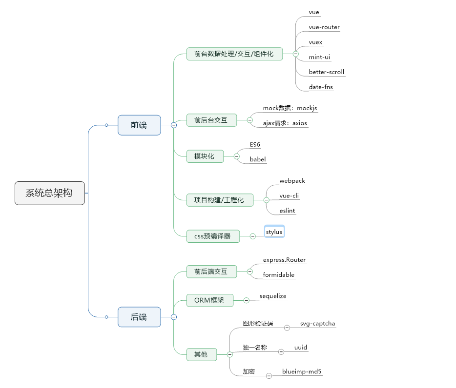
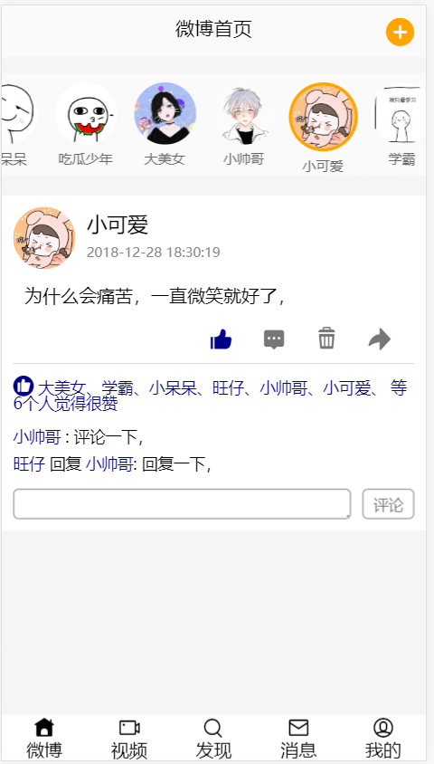
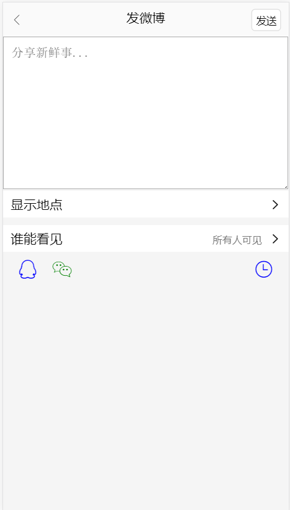
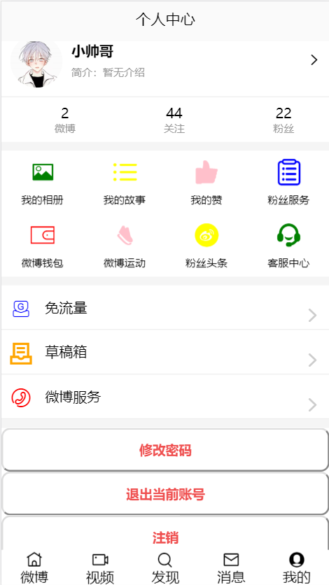
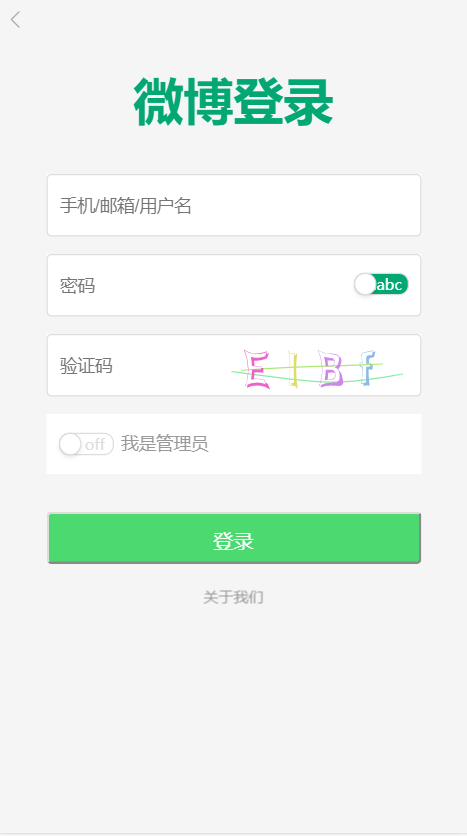
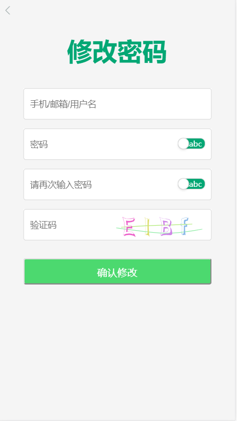

## 项目简介

这个项目是应学校课程考核要求，基于B/S架构的web app，其灵感来自于ios的微博和TIM，这个项目采用的是Vue + Express + Sequelize的技术栈，用于Vue初学者，学习和交流。
## 项目运行
```
git clone https://github.com/Crazy-LD/WeiBo_Imitation.git

cd WeiBo_Imitation

npm install

npm start

访问http://localhost:8080
```
## 系统总架构



## 后端代码

[后端代码](https://github.com/Crazy-LD/WeiBo_Imitation_server)

## 功能

- [x] 用户(管理员)登录
- [x] 注册
- [x] 修改密码
- [x] 注销账户
- [x] 发微博
- [x] 删微博
- [x] 点赞
- [x] 评论

## 页面截图
      

## 项目结构

```
weibo_client
  - build
  - config                    // 配置文件
  - node_modules
  - printscreen               // 项目截图
  - src
    - api
      - ajax.js               // ajax函数请求
      - api.js                // 接口请求模块
    - common
      - images                // 公共图片
      - stylus                // 公共样式
    - components              // 公共组件
      - AlertTip              // 提示框
      - FooterGuide           // 底部导航
      - Header                // 头部信息
      - LoginAndChange        // 登录和修改密码
    - filters
      - index.js              // 过滤器
    - mock
      - data.json             // mock数据源
      - mockServer.js         // mock拦截
    - pages                   // 容器组件
      - ChangePwd             // 修改密码
      - Find                  // 发现
      - Login                 // 登录
      - Message               // 消息
      - Msite                 // 主页
      - Profile               // 我的
      - SendWeibo             // 发送微博
      - SetAvatar             // 设置头像
      - Video                 // 视频
      - WelCome               // 欢迎
    - router
      - index.js              // 路由管理
    - store                   // 状态管理
      - actions.js            // 异步分发
      - getters.js            // getter函数
      - index.js              // 注册状态管理
      - mutation_types.js     // mutation常量
      - state.js              // 状态
    - App.vue                 // 主Vue入口
    - main.js                 // 渲染配置
  - static
    - css
      -reset.css              // 重置浏览器样式
```

